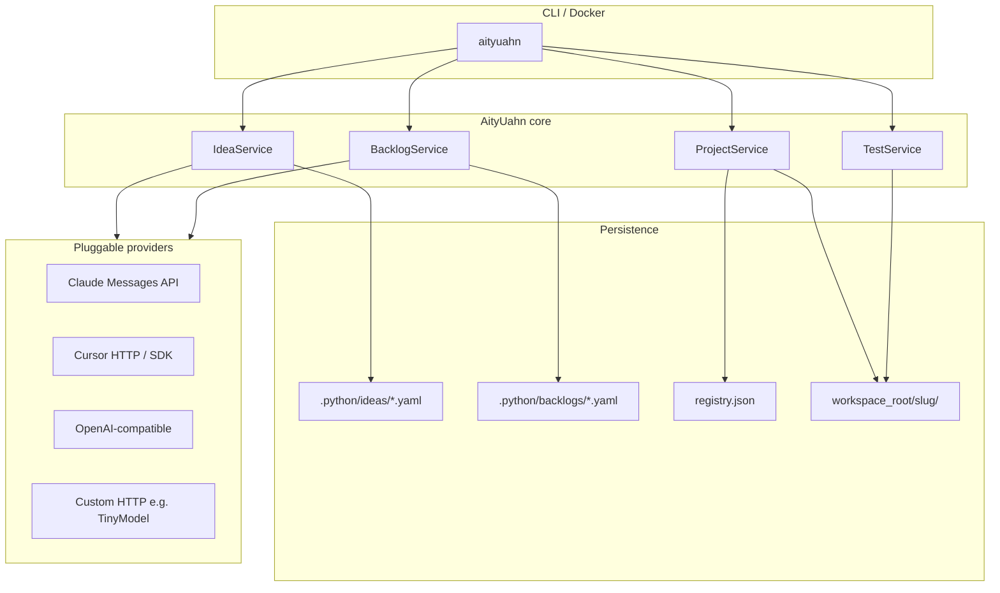

<div align="center">

# AityUahn

### A configurable forge for ideating, scaffolding, and developing projects

[](pyproject.toml)
[](LICENSE)

</div>

**AityUahn** automates the lifecycle you use for sibling projects under a shared workspace — for example `HyperlinksSpaceProgram`, `TinyModel`, and the next idea you describe in chat. It runs **locally** (CLI on your machine) or **in the cloud** (Docker), and connects to **pluggable AI backends**: [Claude API](https://platform.claude.com/docs/en/api/overview), [Cursor API / SDK](https://cursor.com/docs/api), OpenAI-compatible gateways, or your own HTTP stack (including **TinyModel**).

| Capability | What AityUahn does |
| --- | --- |
| **Ideas** | Turn a short prompt into a structured project brief (title, vision, constraints, success criteria). |
| **Backlogs** | Generate or maintain task lists with status, priority, dependencies, and progress %. |
| **Scaffold** | Create `workspace_root/<slug>/` with README, dirs, and `.python` metadata. |
| **Progress** | Track task states (`backlog` → `in_progress` → `done`) and test run history. |
| **Testing** | Run `pytest`, `npm test`, or custom commands; store results on the backlog. |
| **AI providers** | Configure many providers in `forge.yaml`; route ideas, backlogs, and tasks separately. |

Repository: [github.com/HyperlinksSpace/AityUahn](https://github.com/HyperlinksSpace/AityUahn)

**Guides:** [Test & Launch](docs/TEST_AND_LAUNCH.md) · [Guide (HTML)](docs/guide.html) · [Deploy SaaS (Vercel + Neon)](docs/DEPLOY_VERCEL.md) · [Windows installer](docs/INSTALL_RELEASE.md)

---

## Quick start (local)

### 1. Install

```bash
cd C:/1/1/1/1/1/AityUahn
python -m venv .venv
source .venv/Scripts/activate   # Windows Git Bash
pip install -e ".[dev]"
```

### 2. Configure

```bash
cp config/forge.example.yaml forge.yaml
cp .env.example .env
```

Edit `forge.yaml`:

- Set `workspace_root` to your projects parent (default `C:/1/1/1/1/1`).
- Enable providers and set `api_key_env` names.
- Optionally set `idea_provider`, `backlog_provider`, `task_provider` to different IDs.

Add API keys to `.env` (never commit `.env`):

```env
ANTHROPIC_API_KEY=sk-ant-...
CURSOR_API_KEY=crsr_...
```

### 3. Forge a new project (full pipeline)

```bash
aityuahn forge "A tiny HTTP service that proxies embeddings from TinyModel for RAG pipelines"
```

This will:

1. Generate and save an **idea** under `.python/ideas/<slug>.yaml`
2. Generate a **backlog** under `.python/backlogs/<slug>.yaml`
3. **Scaffold** `C:/1/1/1/1/1/<slug>/` with README and standard folders

### 4. Inspect and iterate

```bash
aityuahn list
aityuahn backlog my-project --generate   # regenerate tasks from idea
aityuahn task my-project add "Add CI workflow"
aityuahn task my-project start --id T-a1b2c3d4
aityuahn test my-project
aityuahn providers
```

### 5. Web app (landing + controller)

**Landing** (marketing, sign-in, pricing): open `/` when running `aityuahn serve`, or GitHub Pages.

**Controller** (kanban, forge, agents): `/controller.html`

```bash
aityuahn serve
# Landing:  http://127.0.0.1:8765/
# App:      http://127.0.0.1:8765/controller.html
# Demo:     http://127.0.0.1:8765/controller.html?demo=1
```

#### B2B plans

| Plan | Price | Includes |
| --- | --- | --- |
| **Personal** | Free | 1 user, 1 project, bring your own API keys |
| **Team** | $49/seat/mo (demo billing) | Shared project, members, owner-managed API pool |

Sign up on the landing page → create a **team project** → invite members by email (they must register first) → set **shared API** under **Team & API** so all members use the same provider keys and codebase slug.

SaaS API: `/api/saas/auth/register`, `/api/saas/projects`, `/api/saas/projects/{id}/members`, …

- **Dashboard:** `/` — project cards, progress bars, task start/done controls
- **UI:** forge / idea / backlog panels for API testing
- **API:** `/api/dashboard`, `/api/health`, `/api/registry`, `/api/idea`, `/api/forge`, … — OpenAPI at `/docs`

### GitHub Pages (forge controller UI)

The **same controller** as `aityuahn serve` — kanban board, task list, forge pipeline, and agent prompts — runs on GitHub Pages. Pages hosts the UI; **agents and forge require a live API** (`aityuahn serve` locally or deployed to a cloud host).

1. **Settings → Pages → Build and deployment → Source: GitHub Actions** (not “Deploy from branch / root” — that renders `README.md` as plain text)
2. Push to `main` (workflow `.github/workflows/pages.yml` publishes `docs/`)
3. Open **https://hyperlinksspace.github.io/AityUahn/**
4. Run `aityuahn serve` and connect **`http://127.0.0.1:8765`** (use a tunnel to reach localhost from the browser)

**Hard refresh** if you still see the old README page: **Ctrl+Shift+R** (Windows/Linux) or **Cmd+Shift+R** (Mac).

**Views:** Kanban · Task list · Forge & backlog · Agents · **Docs** (header menu)

Offline demo mode previews kanban/task UI without an API.

```bash
python scripts/build_pages.py
```

---

## Architecture



### Where the Python files live

There are **no `.py` files at the repo root** — only config, docs, and tooling. Application code lives in the **`python/`** package (lowercase; standard for Python imports). Top-level scripts and tests are separate:

| Location | Python files |
| --- | --- |
| **Repo root** | _(none)_ |
| **`python/`** | `__init__.py`, `cli.py`, `config.py`, `forge.py`, `ideas.py`, `backlog.py`, `models.py`, `projects.py`, `storage.py`, `testing.py` |
| **`python/providers/`** | `__init__.py`, `base.py`, `registry.py`, `claude.py`, `cursor.py`, `openai_compat.py`, `http_custom.py` |
| **`tests/`** | `test_config.py`, `test_storage.py` |
| **`scripts/`** | `run_cursor_agent.py` |

CLI after install: `aityuahn` (alias `au`).

### Directory layout

```
AityUahn/
├── python/           # Python package
│   ├── cli.py            # `aityuahn` / `au` commands
│   ├── config.py         # forge.yaml loader
│   ├── ideas.py          # Idea generation
│   ├── backlog.py        # Tasks & progress
│   ├── projects.py       # Scaffold under workspace_root
│   ├── testing.py        # Run & record tests
│   ├── forge.py          # Orchestrator
│   └── providers/        # claude, cursor, openai_compat, http
├── config/forge.example.yaml
├── scripts/run_cursor_agent.py
├── Dockerfile
└── docker-compose.yml

<workspace_root>/          # e.g. C:/1/1/1/1/1
├── HyperlinksSpaceProgram/
├── TinyModel/
├── MyNewProject/         # forged scaffold
│   ├── README.md
│   ├── src/ tests/ docs/ scripts/
│   └── .python/project.yaml
└── AityUahn/
    └── .python/      # ideas, backlogs, registry (default)
```

---

## CLI reference

| Command | Description |
| --- | --- |
| `aityuahn init` | Ensure forge data dirs exist; print paths. |
| `aityuahn list` | List ideas, backlogs, registered projects. |
| `aityuahn idea "<prompt>"` | Generate structured idea YAML. |
| `aityuahn backlog <slug>` | Show backlog table and progress. |
| `aityuahn backlog <slug> --generate` | AI-generate tasks from idea. |
| `aityuahn task <slug> add "<title>"` | Add a manual task. |
| `aityuahn task <slug> start\|done\|block --id T-...` | Update task status. |
| `aityuahn scaffold <slug>` | Create project folder from saved idea. |
| `aityuahn forge "<prompt>"` | Idea + backlog + scaffold in one step. |
| `aityuahn test <slug> [--command "..."]` | Run tests; record on backlog. |
| `aityuahn prompt "<text>"` | One-off completion via default provider. |
| `aityuahn providers` | List configured providers. |
| `aityuahn serve [--demo]` | HTTP API + dashboard UI (default port 8765). |

Global option: `--config path/to/forge.yaml`

Environment overrides (prefix `PYTHON_`):

| Variable | Effect |
| --- | --- |
| `PYTHON_CONFIG` | Path to `forge.yaml` |
| `PYTHON_WORKSPACE_ROOT` | Override workspace parent |
| `PYTHON_FORGE_DATA_DIR` | Override `.python` location |

---

## Configuring AI providers

All providers are declared in `forge.yaml` under `providers`. Each entry has:

| Field | Meaning |
| --- | --- |
| `id` | Name used in CLI `--provider` and role overrides. |
| `kind` | `claude`, `cursor`, `openai_compat`, `http` |
| `enabled` | Toggle without deleting config. |
| `default` | Fallback when no role-specific provider is set. |
| `model` | Model id for that backend. |
| `api_key_env` | Environment variable for the secret. |
| `base_url` | API base (Cursor, Ollama, TinyModel, etc.). |
| `options` | Provider-specific JSON (paths, auth mode, templates). |

### Claude (Anthropic)

Uses the [Messages API](https://platform.claude.com/docs/en/api/overview) (`POST https://api.anthropic.com/v1/messages`).

```yaml
- id: claude
  kind: claude
  enabled: true
  default: true
  model: claude-sonnet-4-20250514
  api_key_env: ANTHROPIC_API_KEY
```

Best for: **idea** and **backlog** generation (structured JSON from the model).

### Cursor

Two integration paths:

1. **HTTP** — `kind: cursor` with `base_url: https://api.cursor.com` and Bearer/Basic auth per [Cursor APIs Overview](https://cursor.com/docs/api). Configure `options.completion_path` if your team exposes an OpenAI-compatible gateway.
2. **SDK (recommended for coding tasks)** — install `cursor-sdk` and use `scripts/run_cursor_agent.py` against a forged project directory. See [Cursor Python SDK](https://cursor.com/docs/sdk/python).

```yaml
- id: cursor
  kind: cursor
  enabled: true
  model: composer-2.5
  api_key_env: CURSOR_API_KEY
  base_url: https://api.cursor.com
```

Set `task_provider: cursor` in `forge.yaml` when you wire task execution through Cursor agents.

```bash
pip install cursor-sdk
python scripts/run_cursor_agent.py C:/1/1/1/1/1/MyProject "Implement the first backlog task"
```

### OpenAI-compatible (OpenAI, Ollama, vLLM, LiteLLM)

```yaml
- id: ollama
  kind: openai_compat
  enabled: true
  model: llama3.2
  base_url: http://127.0.0.1:11434/v1
```

### Custom HTTP (TinyModel, internal APIs)

For a local Gradio or REST wrapper:

```yaml
- id: tinymodel
  kind: http
  enabled: true
  base_url: http://127.0.0.1:7860
  options:
    path: /api/chat
    response_json_path: text
    body_template:
      prompt: "{prompt}"
```

Point `default_provider` or role providers at `tinymodel` when you want the forge to use your own stack.

### Role-based routing

```yaml
default_provider: claude
idea_provider: claude
backlog_provider: claude
task_provider: cursor
```

Ideas and backlogs can stay on Claude; implementation work can go to Cursor SDK or another provider.

---

## Backlog model

Tasks are stored in `.python/backlogs/<slug>.yaml`:

| Field | Description |
| --- | --- |
| `id` | Stable id (`T-xxxxxxxx`) |
| `title` / `description` | Work item |
| `status` | `idea`, `backlog`, `in_progress`, `blocked`, `review`, `done`, `cancelled` |
| `priority` | 1–100 (higher = sooner) |
| `depends_on` | List of task ids |
| `test_command` | Optional verification command |
| `test_runs` | History of `aityuahn test` executions |

Progress is computed as `done / total` and shown in `aityuahn backlog <slug>`.

---

## Running in the cloud (Docker)

```bash
# Prepare config on the host
cp config/forge.example.yaml config/forge.yaml
# Edit config/forge.yaml — use /workspace inside the container

docker compose --profile cli build
docker compose --profile cli run --rm aityuahn list
docker compose --profile cli run --rm aityuahn forge "Edge cache for static assets"
```

Compose mounts:

- Host workspace → `/workspace` (where new projects are created)
- Named volume `forge-data` → persistent `.python` state

Set `WORKSPACE_ROOT` in the environment or `.env` for compose volume paths on Windows.

For CI/CD (GitHub Actions, cron, Kubernetes Job):

1. Build and push the image.
2. Mount secrets as env vars (`ANTHROPIC_API_KEY`, `CURSOR_API_KEY`).
3. Run `aityuahn forge "..."` or `aityuahn backlog <slug> --generate` on a schedule.

---

## Development workflow (recommended)

1. **Describe** the project in natural language (as you do in Cursor chat).
2. **`aityuahn forge "..."`** — materialize idea, backlog, and folder.
3. **Review** `.python/ideas/<slug>.yaml` and edit if needed.
4. **`aityuahn backlog <slug>`** — refine tasks manually or `--generate` again.
5. **Implement** with Cursor IDE, or `scripts/run_cursor_agent.py` for SDK automation.
6. **`aityuahn task <slug> done --id T-...`** — track progress.
7. **`aityuahn test <slug>`** — verify; failures stay on the backlog record.
8. **Repeat** for sibling projects under the same `workspace_root`.

### Example: project like TinyModel

```bash
aityuahn idea "Small-language-model stack for classification and a Gradio chat Space" --slug tinymodel-v2
aityuahn backlog tinymodel-v2 --generate
aityuahn scaffold tinymodel-v2
# Develop under C:/1/1/1/1/1/tinymodel-v2
aityuahn test tinymodel-v2 --command "pytest -q"
```

---

## Testing AityUahn itself

See **[docs/TEST_AND_LAUNCH.md](docs/TEST_AND_LAUNCH.md)** for the full launch paths, architecture, UI/CLI/SaaS checklist, and troubleshooting.

```bash
pip install -e ".[dev]"
aityuahn serve --demo          # terminal 1
aityuahn doctor                # terminal 2 — probe forge + optional cloud
pytest -q
ruff check python tests
```

---

## Roadmap (foundation → next)

This release is **v0.1 foundation**. Planned extensions:

- [x] Web UI dashboard for ideas, progress, and task controls
- [ ] Git init + remote create on scaffold
- [ ] Task execution worker (queue + provider per task)
- [ ] Cursor Cloud Agents polling (`/v1/agents`) built into CLI
- [ ] Import existing repos into registry
- [ ] Hooks: on `done` → auto-run `test_command`

Contributions and issues welcome on GitHub.

---

## Security

- Store API keys only in `.env` or your secret manager.
- `forge.yaml` is gitignored when it contains secrets; use `forge.example.yaml` as the template.
- Forged projects get their own `.gitignore`; review before pushing.

---

## License

MIT — see [LICENSE](LICENSE).
